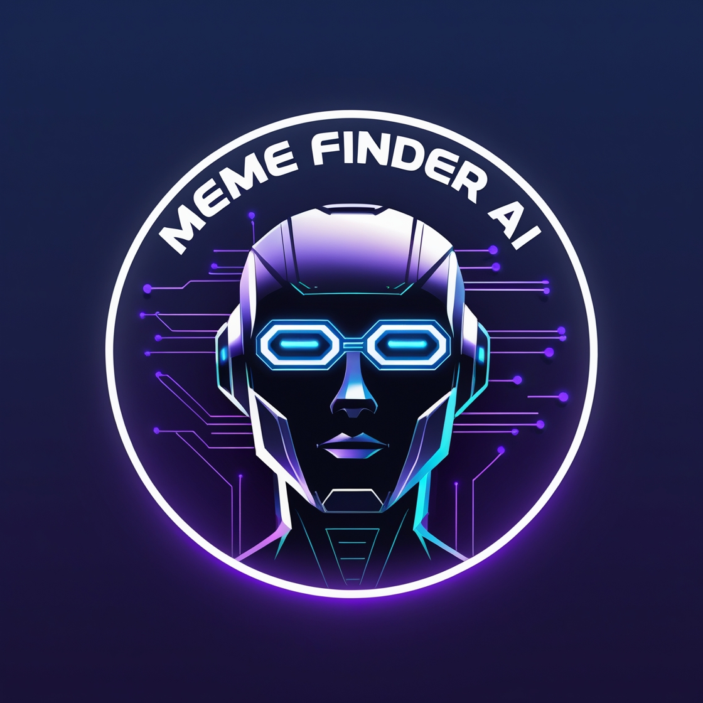

# 📌 Meme Search App



A powerful AI-driven image-based meme search application that extracts text, generates image descriptions, and retrieves relevant memes using FAISS indexing and deep learning embeddings.

---

## 🚀 Features

- 📝 **Extracts text** from images using **Tesseract OCR** and **EasyOCR**.
- 🖼️ **Generates image descriptions** using **Google Vision API**.
- 🔍 **Creates embeddings** of descriptions using **Sentence Transformers**.
- ⚡ **Utilizes FAISS (Facebook AI Similarity Search)** for fast and efficient meme search.
- 🎯 **Processes queries** and returns the most relevant memes.

---

## 🔧 Installation

### 📋 Prerequisites

Ensure you have the following installed:

- Python 3.8+
- Pip
- Virtual environment (optional but recommended)
- A Google Cloud Vision API Key JSON file

### 📥 Clone the Repository

```bash
git clone https://github.com/yourusername/meme-search-app.git
cd meme-search-app
```

### 🏗️ Create a Virtual Environment (Optional but Recommended)

```bash
python -m venv venv
source venv/bin/activate  # On Windows use `venv\Scripts\activate`
```

### 📦 Install Dependencies

```bash
pip install -r requirements.txt
```

### 🔑 Setup Google Cloud Vision API

1. Obtain a Google Cloud Vision API key file (`.json`).
2. Place the key in the root folder and update its name in `app.py`:

```python
credentials = service_account.Credentials.from_service_account_file('your-key-file.json')
```

### ▶️ Run the Application

```bash
python app.py
```

---

## 🛠️ Usage

1. Place your meme images inside the `memes/` directory.
2. Run the script and enter a query to find relevant memes.

```bash
python app.py
```

3. Input your search query and receive the most relevant memes with similarity scores.

---

## 📚 Libraries Used

| Library                 | Purpose                                   |
| ----------------------- | ----------------------------------------- |
| `cv2` (OpenCV)          | Image processing                          |
| `pytesseract`           | OCR for text extraction from images       |
| `easyocr`               | Advanced OCR for text detection           |
| `faiss`                 | Vector similarity search                  |
| `numpy`                 | Numerical computations                    |
| `PIL` (Pillow)          | Image handling                            |
| `google.cloud.vision`   | Image labeling and description generation |
| `sentence_transformers` | Text embedding generation                 |

---

## 📂 Project Structure

```
├── app.py
├── memes/  # Folder containing meme images
├── banner.jpg  # Repository banner image
├── requirements.txt
└── README.md
```

---

## 🚀 Future Improvements

- 💻 Implement a GUI-based web interface using Flask or Streamlit.
- 🏆 Improve accuracy with better OCR and text filtering.
- 📊 Expand the dataset for better generalization.

---

## 🤝 Contributing

Pull requests are welcome! Feel free to contribute by improving the project, fixing bugs, or adding new features.

---

## 📜 License

This project is licensed under the MIT License. See `LICENSE` for details.

---

✨ Developed with ❤️ by YourName ✨

